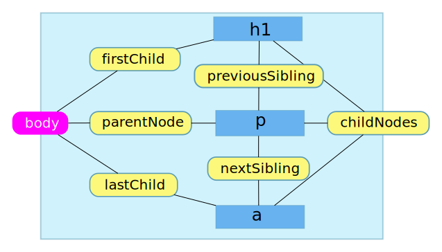

# Document Object Model

## Introducere

DOM este acronimul de la Document Object Model. DOM este un API (Application Programming Interface) pentru documentele HTML și XML. DOM-ul trebuie văzut ca un liant între tagurile HTML și JavaScript, fiind astfel permisă interacțiunea cu pagina.

Standardul spune că „programatorii pot redacta documente, pot parcurge structura lor și pot adăuga, modifica sau șterge elementele și conținutul acestora”.

Să vedem ce înseamnă „document” în cazul acestui API. Standardul spune că termenul de „document” este utilizat în sens larg și se leagă de capacitatea XML-ului de a „reprezenta diferite tipuri de informație care pot fi stocate în diferite sisteme și mare parte dintre acestea vor fi văzute în mod tradițional ca date și nu ca documente”. Următoarea precizare este fundamentală pentru a înțelege relația dintre date, informație și reprezentarea acestora. Zice standardul: **[...] XML prezintă aceste date ca documente iar DOM-ul poate fi utilizat pentru a gestiona aceste date**.

Standardul (DOM Core) spune că „prezintă documentele ca o ierarhie de obiecte Node care implementează alte interfețe mai specializate”. Hai să lămurim nițel care-i treaba cu interfețele astea. Sunt de fapt niște abstracțiuni implementate la nivel de browser de către fiecare producător de browser așa cum crede mai bine și au drept scop punerea la dispoziție de metode și proprietăți pentru a manipula diferite reprezentări de date.

## Ce sunt nodurile?

Nodul este un nume dat oricărui tip de obiect din ierarhia DOM. Nodurile pot fi obiectele native ale DOM cum ar fi `document` sau `document.body`, dar poate fi foarte bine și reprezentarea ca obiect a unui tag de HTML.

Nodurile pot fi de mai multe tipuri: noduri document, noduri text, noduri elemente, etc. Fiecare obiect nod al DOM-ului are o proprietate `nodeType`.

## Lucrul cu DOM

DOM-ul este de fapt o ierahie, un arbore de noduri. Fiecare dintre aceste noduri are un nod părinte, unul sau mai multe copil și unul sau mai multe pe același nivel ca și el.

Fiecare `nodeType` conține un cod sub forma unui număr care identifică tipul nodului. Elementele comune au valoarea 1, o valoare pe care o poartă constanta ca proprietate `document.ELEMENT_NODE`.

```javascript
elementIdentificat.nodeType === 3;
```

Nodurile care sunt de text au valoarea 3 pentru constanta `document.TEXT_NODE`.

Se mai poate face o verificare folosind `instanceof`.

```javascript
elementIdentificat.nodeType instanceof Text
```

`document.documentElement` este rădăcina tuturor elementelor.
`document.body` este rădăcina întregului body.



## childNodes

Este un obiect array-like.
De exemplu, poți afla numărul de elemente: `document.body.childNodes.length`

## `firstChild` și `lastChild`

Pentru nodurile care nu au copii, valoarea acestora este `null`.

## `previousSibling` și `nextSibling`

Aceste proprietăți trimit la nodurile învecinate.
Pentru `firstChild` a primului nod copil, valoarea este `null`.

## Referințe online

https://www.w3.org/TR/REC-DOM-Level-1/introduction.html
https://www.w3.org/TR/REC-DOM-Level-1/level-one-core.html
