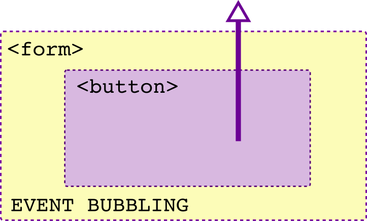
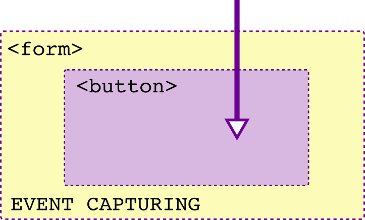
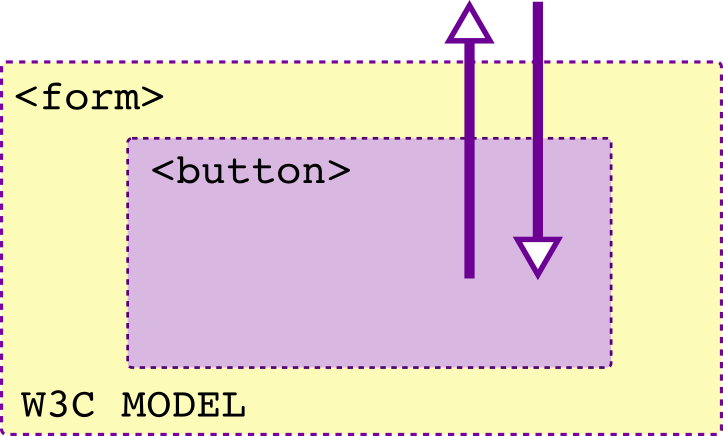

# Evenimente

„Programarea dictată de evenimente se întâmplă atunci când un sistem este interesat de un set de evenimente, oferă o cale de a fi anunțat atunci când evenimentele se întâmplă și răspunde la acestea folosind callback-uri”. (*Beautiful Javascript*, Jonathan Barronville).

## Mantre

- HTML nu este DOM.
- callback-ul este un closure a cărui funcție va fi invocată atunci când un anumit eveniment se întâmplă.
- un eveniment este de fapt modificarea la un moment dat a stării unui sistem.
- Evenimentele nu pornesc de la elementul care este cauza evenimentului (apăsarea unui buton), ci de la elementul rădăcină, de la `window` în cazul browserului și va merge din ramură în ramură până la elementul căruia îi este destinat. În drumul său, fiecare element din cale va „ști” despre acest eveniment. Acestă primă fază se numește `capturing phase`.
- Capturarea unui eveniment returnează un eveniment. Datele depind de tipul evenimentului.
- După ce evenimentul a ajuns la elementul țintit, acesta va porni înapoi către elementul rădăcină `window` alertând toate elementele din cale. Această fază se numește `bubbling phase` sau faza a doua.

## Anatomie

Pentru a răspunde unui eveniment, browserul, mai întâi trebuie să *captureze* evenimentul iar această etapă se numește „înregistrarea evenimentului” - `event registration`. Mecanismul prin care se face acest lucru este acela al event handlers.

Cel mai simplu event handler este cel pe care-l oferă un atribut pus direct în codul HTML.

```html
<html>
  <head>
    <title>Atașare event handler</title>
  </head>
  <body>
    <div>
      <p onclick="alert('un eveniment')">Acesta este un paragraf!</p>
    </div>
  </body>
</html>
```

Această modalitate trebuie evitată în practica de zi cu zi. Ceea ce vei ajunge să faci este folosirea unei metode de selectare a unui element DOM `getElementById` sau `querySelector` și apoi vei atașa evenimentul.

```javascript
var x = document.getElementById('identificator');
x.onclick = function () {
  alert('am fost apasat');
};
```

Am ajuns la modul în care vei folosi evenimentele la momentul scrierii codului dedicat. În mod curent vei *atașa* evenimente folosind metoda `addEventListener(numeEveniment, numeFunctie, true/false)`.

Să atașăm un eveniment unui buton.

```javascript
var elementApasat = document.querySelector("#identificator");
function faCeva () {
  alert('s-a petrecut ceva');
};
elementApasat.addEventListener("click", faCeva, true);
```

Cel de-al treilea argument (`true`) specifică faptul că evenimentul va fi capturat. O valoare `false` înseamnă `bubble`.

Reține că folosirea metodei `addEventListener` permite verificarea pentru a vedea dacă sunt mai multe evenimente la un singur apel.

Pentru a vedea mai multe detalii despre eveniment, haideți să „capturăm” obiectul rezultat de eveniment. Pentru a realiza acest lucru, pasăm funcției cu rol de callback însuși obiectul eveniment.

```javascript
var elementApasat = document.querySelector("#identificator");
function faCeva (eveniment) {
  console.log(eveniment);
};
elementApasat.addEventListener("click", faCeva, true);
```

Câteva informații interesante apar în consolă la o inspecție a conținutului obiectului eveniment:

- `type`, fiind tipul evenimentului, în cazul nostru click;
- `timestamp`, fiind momentul la care a apărut evenimentul;
- `defaultPrevent`, fiind un Boolean care dacă este `true` înseamnă că va împiedica comportamentul normal al elementului... gândește-te că e un buton care trebuie să facă un apel pentru a aduce date de undeva. Dacă este `false`, va face acel lucu, dacă nu, va avea un comportament deturnat în alt scop.
- `originalTarget`, fiind elementul care a declanșat evenimentul.
- `target`, fiind elementul țintit de eveniment.

Și acum câteva informații utile privind poziționarea elementului:

- screenX,Y îți dă poziția relativ la ecranul utilizatorului
- clientX,Y își dă poziția relativ la fereastra deschisă
- offsetX,Y îți dă poziția relativ la elementul care a inițiat evenimentul
- pageX,Y îți dă poziția relativ la documentul HTML,
- layerX,Y îți dă poziția față de un alt element.

Poți obține informații despre care combinație de taste a fost folosită pentru a declanșa evenimentul:

- altKey: false/true,
- ctrlKey: false/true,
- shiftKey: false/true.

## Propagarea evenimentului - event propagation

Un element părinte va permite capturarea tuturor evenimentelor apărute la elementele copil. Să ne uităm nițel cam cum ar apărea.

```html
<!DOCTYPE html>
<html>
  <head>
    <meta charset="utf-8">
    <title>Test event propagation</title>
  </head>
  <body>
    <div id="identificator">
      <p>Un fragment.</p>
      <p>Alt fragment.</p>
    </div>
    <script type="text/javascript">
      var elemCapturat = document.getElementById('identificator');
      elemCapturat.addEventListener('click', arataDetalii, true);
      function arataDetalii (eveniment) {
        console.log(eveniment);
      };
    </script>
  </body>
</html>
```

Ceea ce se observă imediat este faptul că indiferent că am dat click pe oricare dintre cele două paragrafe, evenimentul a fost emis chiar dacă „receptorul” (event listener-ul) a fost setat la elementul părinte al celor două paragrafe.

Vom observa că proprietatea `target` a evenimentului, va avea valoarea elementului DOM care a fost acționat.

## Două modele: captură (capture) și ridicarea la suprafață (bubbling)

Să presupunem că avem două elemente unul fiind containerul celui de-al doilea. Ambele evenimente au același eveniment atașat: onclick. Ceea ce se întâmplă este că în cazul unui click pe elementul găzduit, se declanșează ambele evenimente, adică și `onclick` de la părinte.

Întrebarea este următoarea: care event handler s-a executat primul?

Aici intervin cele două modele pentru a înțelege. A existat un moment când Netscape și Microsoft nu au căzut de acord asupra unui model comun și asftel, s-au născut două modele diferite care coexistă. Cel al lui Netscape care spune că evenimentul elementului gazdă se va declanșa primul, numindu-se „capturing” și modelul Microsoft care spune că elementul găzduit, cel care a fost acționat primul se va declanșa primul, numindu-se „bubbling”.





### MODELUL CURENT

Pentru armonizare, W3C a fost de acord ca cele două modele să coexiste după următorul scenariu: orice eveniment se declanșează, mai întâi de orice este capturat și este declanșat în toți copii (dacă aceștia au event handlere - receptori cu true), până când ajunge la cel vizat (`target element`), după care face „bubbling”, adică se ridică din nou către gazdă.



Partea bună este că te poți decide singur când vei „înregistra” evenimentul, fie în faza de capturare, fie în faza de bubbling folosind metoda `addEventListener`. Dacă cel de-al treilea argument este setat la `true`, atunci evenimentul va fi „înregistrat” la faza de capturare, iar inversul indică faza de bubbling.

## Cazuistică

### Container true (capturing), copilul false (bubbling)

Condiții: utilizatorul dă click pe elementul copil.

```html
<div id="identificator">
  <p id="primo">Un fragment.</p>
</div>
<script type="text/javascript">
  var elemContainer = document.getElementById('identificator'),
      elemCopil     = document.getElementById('primo');

  function arataDetaliiGazda (eveniment) {
    console.log(eveniment);
  };
  function arataDetaliiCopil (eveniment) {
    console.log(eveniment);
  };

  elemContainer.addEventListener('click', arataDetaliiGazda, true);
  elemCopil.addEventListener('click', arataDetaliiCopil, false);
</script>
```

Având în minte modelul W3C, evenimentul `click` mai întâi de orice este capturat.

Apoi motorul se va uita mai întâi pe ramurile DOM părinte ale elementului care a fost acționat pentru a găsi dacă este vreunul dintre acestea în modul `capture`.
În cazul nostru, chiar dacă elementul acționat este în faza de `bubbling` după cum indică cu `false` receptorul de eveniment - addEventListener, elementul părinte la care se uită mai întâi și mai întâi motorul este în faza de `capture`.
Efectul acestui aranjament este că se va executa mai întâi funcția de la părinte: `arataDetaliiGazda()`.

Deci, evenimentul va porni de la părinte și se va propaga către copil executând toate callback-urile pentru receptoarele setate la `capture` pentru evenimentul `click`.

Ajungând la copil, evenimentul va executa callback-ul pentru copil și evenimentul va intra în faza de bubbling, executând în orine către părinte toate callback-urile pentru care al treilea paramentru este setat la `false`.

### Container false (bubbling), copilul false (bubbling)

Evenimentul `click` pornește în faza de capturing.

Apoi motorul se uita dacă există vreun părinte pornind de la elementul care a fost acționat și care are capturing-ul activat prin `true`. În cazul nostru nu. Pentru că nu există niciun `onclick` listener în capture la vreun părinte, mototul pornește să facă bubbling de la elementul acționat către container. Astfel, este apelat `arataDetaliiCopil()` urmată de `arataDetaliiGazda()`.

## Resurse

https://quirksmode.org/js/events_order.html

[3.1. Event dispatch and DOM event flow](https://www.w3.org/TR/DOM-Level-3-Events/#event-flow)
