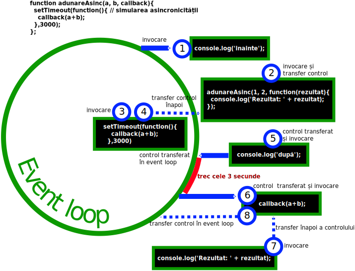

# Ce sunt callback-urile?

Un callback este o secvență de cod executabilă care este pasată ca argument unei funcții. Aceasta este „apelată” - „called back” de către funcție la un moment ulterior.

## Dependințe cognitive:

- scope
- this
- closures

Este o funcție care este executată ca răspuns la un eveniment. Ori de câte ori o funcție este construită pentru a fi apelată ulterior, fie de browser, fie de o altă parte a codului, aceasta se numește `callback`.

Un callback este o funcție (un obiect, de fapt), care este pasată ca argument unei alte funcții și care este invocată atunci când se ajunge la un rezultat. Pe scurt, rezultatul funcției nu este întors celui care a invocat-o, ci este preluat de callback și acesta are rolul de a returna ceva.

În programarea funcțională, acest mod de a propaga rezultatul se numește „continuation-passing style” (CPS). Returnarea rezultatului dintr-o funcție se numește „direct style”.

```javascript
// exemplificare direct style versus continuation-passing style

function adunare(a, b){
  return a + b;                      // direct style
};

// adunare ca operațiune sincronă
function adunare(a, b, faAdunarea){
  faAdunarea(a + b);                // continuation-passing style
};                                  //se va returna o valoare abia după ce callback-ul și-a încheiat execuția

adunare(1, 2, function(rezultat){  // callbackul primește un singur argument, care reflectă evaluarea operațiunii a+b
  console.log('Rezultatul este: ' + rezultat);
});

// adunarea ca operațiune asincronă
function adunareAsinc(a, b, callback){
  setTimeout(function(){ // simularea asincronicității
    callback(a+b);
  },3000);
};

console.log('inainte');
adunareAsinc(1, 2, function(rezultat){  // callbackul primește un singur argument, care reflectă evaluarea operațiunii a+b
  console.log('Rezultat: ' + rezultat);
});
console.log('după');
// mesajul rezultatului apare în consolă după
```

Atenție! funcția adunareAsincrona nu va mai aștepta la execuție să se declanșeze execuția callbackului și va relua execuția mai departe și abia după ce setTimeout va fi terminat, după cele 3 secunde, abia atunci va fi executat și callback-ul. După ce timpul se va fi scurs, execuția callback-ului returnează rezultatul. Menținerea contextului se face datorită closure-ului.

## Anatomie

Pentru fiecare pas al animației, calbackul pasat lui setInterval face closure pe valorile elementTinta și increment și astfel, fiind accesibile ca niște variabile care pot fi accesate dar având valorile modificate.

```html
<div id="element">Un nod de text</div>
<script type="text/javascript">
  function Misca(elem){
    var elementTinta = document.getElementById('element'),
        increment = 0;
    var temporizator = setInterval(function(){
      if(increment < 400){
        elementTinta.style.position = "relative";
        elementTinta.style.background = "red";
        elementTinta.style.left = elementTinta.style.top = increment + "px";
        increment++;
      }else{
        clearInterval(temporizator);
      }
    }, 10);
  };
  Misca("element");
</script>
```

Reține faptul că de fiecare dată când intervalul presetat expiră, funcția care joacă rol de callback reactivează **lexical environment** - scope-ul de la momentul creării. Closure-ul pe care-l face fiecare callback ține evidența la propriul set de variabile.



## Mantre

- Funcțiile pot fi pasate ca argumente altor funcții pentru că, de fapt, este pasat un obiect, este pasată o valoare în sine.
- Funcțiile care acceptă alte funcții drept argumente sau care returnează funcții se numesc „funcții de ordin superior” - „higher-order function”.
- Un callback este un closure a cărui funcție va fi invocată atunci când un anumit eveniment se întâmplă.
- Nu toate funcțiile cărora li se pasează un callback sunt asincrone. Un exemplu este `[1,2].map(function(elem){return elem+1;});`. Rezultatul este returnat sincron folosind „direct style”.
- **`this` al unui callback indică întotdeauna către obiectul global. Pentru a fixa `this` la funcția gazdă se va folosi `call()`, `apply()` sau `bind()`**.
- **Callback-ul care folosește fat arrows este legat de scope-ul lexical și nu mai este nevoie de `call()`, `apply()` sau `bind()`**.
- Invocarea unui callback este invocarea unei funcții a cărui `this` este obiectul global (implicit assignment).

Cel mai simplu exemplu este oferit de execuția la un anumit moment în timp.

```javascript
function arataMesajul(mesaj){
  setTimeout(function(){
    alert(mesaj);
  }, 3000);
}

arataMesajul('funcția internă este chemată după trei secunde');
```

## Folosire

Sunt folosite în bibliotecile de cod pentru că oferă reutilizare. Permite ca metodele bibliotecii să fie ușor de configurat și de extins.

### Utilizare în Node.js

Un exemplu de folosire a callback-urilor în Node.js

```javascript
var fs = require('fs');

var callback = function faCeva(error, data){  // o practică bună este a numi funcțiile pentru a le vedea în stivă
  if(error){
    return callback(error, null);
  };
  // fă ceva cu datele
};

fs.readFile('date.csv', 'utf-8', callback);
```

Atenție, în Node, primul argument al unui callback va fi întotdeauna un obiect de eroare. Acesta este modelul care trebuie urmat. Datele vehiculate constituie cel de-al doilea argument.

## Disciplina folosirii callback-urilor

- Ieși din funcție cât se poate de repede cu `return`, `continue` sau `break`.
- Creează funcții cu nume pentru callback-uri pasând rezultatele intermediare ca argumente.
- Modularizează codul împărțindu-l în funcții mici, reutilizabil ori de câte ori acest lucru este posibil.
