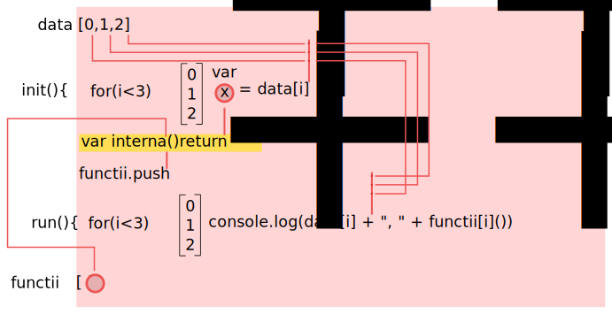
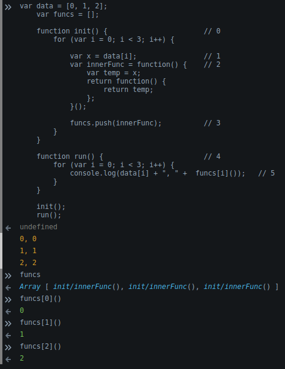

# Closures în bucle

Această zonă a closure-urilor este una ce ține de problemele care apar atunci când o serie de bucle au drept scop încărcarea unui array cu funcții.

### Dependințe cognitive:

- funcții cu aspectele legate de mediul lexical pe care-l formează
- closure-uri
- enunțul `for`.

## Bucle buclucașe - iterări care produc closure-uri

Să ne aducem aminte faptul că ori de câte ori declari o funcție, aceasta face „o fotografie” a mediului lexical în care „s-a născut”.
Buclele buclucașe se referă la faptul că te aștepți la un anumit rezultat, dar pentru că variabilele declarate cu `var` permit ceea ce se numește „shadowing”, adică înlocuirea valorii imediat ce este disponibilă o nouă valoare căreia îi este atribuită, vei avea în closure ultima valoare a buclei pentru acea variabilă, nu valorile de etapă, adică valoarea pentru fiecare iterație.

Să luăm următorul exemplu:

```javascript
var functii = [];
for (var i = 0; i <= 3; i++) {
  functii[i] = function () {console.log(i);};
}; functii;
functii[0](); // 4
functii[1](); // 4
functii[2](); // 4
functii[3](); // 4
```

Probabil că ceea ce ai dori să obții este câte un closure pentru „valorile de etapă”.

Bun, să o luăm pe bucăți să vedem de unde am putea regla. Ceea ce trebuie să ne aducem aminte este faptul că `var i` este declarată în mediul lexical în care a fost inițiată instrucțiunea `for`. Acesta este efectul hoistării. Abia la nivelul lui `for` se va face atribuirea („legarea”) valorii. În cazul nostru este chiar cel „global”. Este ca și cum am scrie:

```javascript
var functii = [],
    i;
for (i = 0; i <= 3; i++) {
  functii[i] = function () {console.log(i);};
};
```

Să ne aducem aminte faptul că funcțiile sunt la rândul lor valori care pot fi introduse într-un array.
Acum, efectul instrucțiunii `for` este că introduce într-un array declarații de funcții, care reprezintă fiecare câte o valoare. Pentru a fi limpede ceea ce tocmai s-a petrecut trebuie să ne aducem minte faptul că în cazul fiecărei funcții care face closure, aceasta face „o fotografie” a mediului în care a fost declarată (de fapt, o legătură dinamică la mediul lexical în care a fost definită), pentru a se putea executa, iar în cazul nostru în „fotografie” se găsește și `i`.
Buclucul vine la invocarea vreunei funcții din array pentru că valoarea lui `i`, după încheierea lui `for` rămâne 3. Când invoci funcția, ce să vezi, va găsi identificatorul, dar nu va mai găsi valoarea de la momentul introducerii în array, ci aceea de la finalul lui `for`.

### Menținerea valorilor de etapă

Soluția pentru a menține valorile de etapă este cea legată de executarea pentru fiecare ciclu a unui IIFE.

```javascript
var functii = [];
for (var i = 0; i <= 3; i++) {
  (function (i) {
    functii[i] = function () {console.log(i);};
  })(i);
};
functii[0](); // 0
functii[1](); // 1
functii[2](); // 2
functii[3](); // 3
```

Soluția funcționează pentru că IIFE-ul creează propriul mediu (scope), care va fi izolat de cel extern, dar care va „ține minte” valoarea din parametru pentru care funcția introdusă în array va face closure.

ECMAScript 2015 oferă `let` în sprijinul „ancorării” valorii la etapă.

```javascript
var functii = [];
for (let i = 0; i <= 3; i++) {
  functii[i] = function () {console.log(i);};
};
functii[0](); // 0
functii[1](); // 1
functii[2](); // 2
functii[3](); // 3
```

Iată un caz de closure care ilustrează cel mai bine felul în care se manifestă și efectele.

Cazul a fost preluat de la resursa online „js by example”: [Closures in loop](https://github.com/bmkmanoj/js-by-examples/blob/master/examples/closures_in_loop.md "Link către resursa originală Closures in loop")

```javascript
var data = [0, 1, 2];
var funcs = [];

function init() {                   // 0
  for (var i = 0; i < 3; i++) {
    var x = data[i];                // 1
    var innerFunc = function() {    // 2
        return x;
    };
    funcs.push(innerFunc);          // 3
  };
};

function run() {                    // 4
  for (var i = 0; i < 3; i++) {
      console.log(data[i] + ", " +  funcs[i]());   // 5
  };
};

init();
run();

// 0, 2
// 1, 2
// 2, 2
```



## init()
init() ciclează de 3 ori iar x va rămâne după finalizarea buclei la valoarea 2.
innerFunction face „enclosing” (circumscrie) variabila x.

La momentul execuției sunt introduse în array-ul `funcs` trei referințe către funcția internă a lui init(), astfel, făcânduse un clojure pe funcția internă.

## run()
La execuție, run(), va executa rând pe rând funcțiile din funcs[]. Toate returnează aceeași valoare, adică ultima rezultată din excuția buclei.

## PROBLEMA
Variabilele din funcțiile interne cu același identificator (x în cazul nostru) sunt legate de aceeași variabilă cu cea din funcția container. Acest lucru se întâmplă pentru că variabilele au același scope stabilit de funcția container. Variabilele nu sunt block scoped, adică limitate la scope-ul creat de funcția internă.


```javascript
var data = [0, 1, 2];
var funcs = [];
function init() {
  for (var i = 0; i < 3; i++) {
    var x = data[i];
    var innerFunc = function() {
      var temp = x;
      return function() {
        return temp;
      };
    }();
    funcs.push(innerFunc);
  }
};
function run() {
  for (var i = 0; i < 3; i++) {
    console.log(data[i] + ", " +  funcs[i]());
  }
};
init();
run();
// 0, 0
// 1, 1
// 2, 2
```



### Diferența dintre binding și assignment - closures în bucle

Crearea unui scope la momentul rulării codului conduce la alocarea unui „spațiu” în memorie pentru fiecare variabilă care se „leagă” de o valoare în respectivul scope.

```javascript
function adunaFunctii(arr) {
  var functii = [], i;
  for (i = 0; i < arr.length; i++) {
    functii.push(function() { console.log(arr[i]);}); // arr[i] nu este valoarea, pentru că i este doar o referință către valoare
  }
  return functii;
};

var colectieFunctii = adunaFunctii([23, 221, 4342]);
var y = colectieFunctii[0];
y(); // undefined

// se poate imagina chiar o funcție care să testeze funcțiile closure
function test(){
  var lista = adunaFunctii([23, 221, 4342]);
  for(var j = 0; j < lista.length; j++){
    lista[j]();
  };
};
test(); // undefined (3)
```

Funcția `adunaFunctii` „leagă” la scope-ul său trei variabile: ***functii, i și n*** iar când este invocată, se alocă „spațiu” în memorie pentru acestea. La fiecare iterare, bucla creează un closure pentru funcția declarată și care este apoi introdusă în array-ul `functii`.
În cazul de mai sus, logica superficială spune că `arr[i]` ar trebui să rezolve la valoare. Dar i, de fapt este o referință către valoare.
Pentru că valoarea lui i se modifică la fiecare iterație, funcțiile declarate vor vedea doar ultima valoare. Acest lucru se întâmplă pentru că un closure stochează valorile externe prin referință, nu prin valoare.
Toate funcțiile create de adunaFunctii, care, de fapt fac closure, stochează o referință către i care exista de dinainte să înceapă iterarea. Între timp, iterarea incrementează valoarea lui i.
La momentul în care se invocă una dintre funcțiile din array-ul constituit, dar care face closure, i are deja valoare 5 (valoarea lui n, care este lungimea array-ului). Este returnat `undefined` pentru că array-ul pasat ca parametru nu are index cu valoarea 5, indexul oprindu-se la 4.

Pentru a face să funcționeze:

```javascript
var functii = [];

function emiteFunctii(index){
  return function(){
    return index;
  };
};

for(var index = 0; index < 5; index++){
  functii[index] = emiteFunctii(index);
};

for(var index in functii){
  console.log(functii[index]());
};
```

Diferența este că `emiteFunctii` este invocat pentru fiecare interație. Ca efect se creează un scope nou iar index este legat de acel scope ceea ce înseamnă ca avem 5 scope-uri create.
