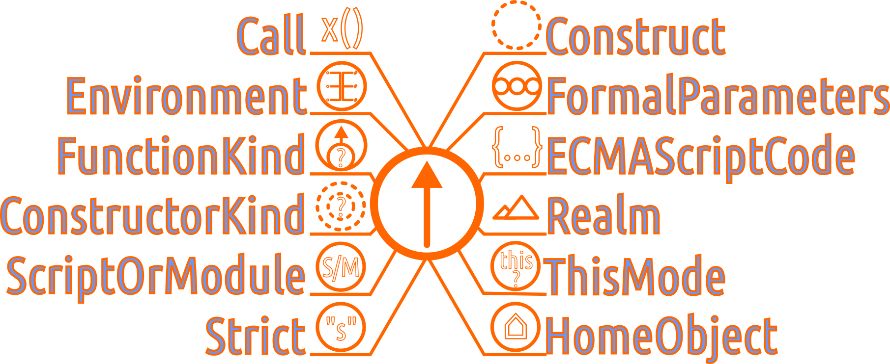

# Dualitatea obiect - funcție

JavaScript este un limbaj care face uz extensiv de obiecte. În geneză, am văzut că exercitând pașii argoritmului intern CreateRealm(), care solicită rularea algoritmului CreateIntrinsics(realmRec), există ca pas crearea primului obiect al limbajului (prin apelarea algoritmului ObjectCreate(null)). Astfel, s-a născut obiectul prototipal, care va fi folosit pentru a forma și obiectul prototipal al funcțiilor.

Prin urmare, putem spune că obiectele și funcțiile - obiect alcătuiesc un system complementar ca și paradigmă. Unul nu poate fără celălalt. În lucrul de zi cu zi, nu ne vom lovi de necesitatea de a lucra cu sloturile interne ale celor două entități. Totuși, o bună cunoaștere a acestor amănunte intime privind obiectele și funcțiile, care se construiesc pe baza obiectelor, este o necesitate pentru a înțelege unitar și pentru a vedea nevoia de a asimila împreună obiectele și funcțiile. Această secțiune a materialului de învășare s-a născut din această necesitate. Am realizat după ce am redactat final capitolul dedicat funcțiilor și pe cel al obiectelor că ar fi o bizarerie să încerc o poziționare a unuia față de celălalt, mai ales că un cititor nefamiliarizat, se va lovi, cu siguranță de concepte pe care nu le-ar înțelege decât dacă le-ar fi știut dinainte. Astfel s-a născut această secțiune ca o conciliere și o aprofundare a unor concepte care vor crea premiza înțelegerii celor două în armonie.

## Sloturi

După cum am aflat din capitolul genezei, motorul JavaScript trebuie să parcurgă o serie de pași aparținând unor algoritmi interni pentru a constitui un Tărâm (Realm) și odată cu acesta și obiectele intrinseci necesare pentru a se porni evaluarea codului sursă JavaScript.
Ceea ce ochiul agil a cules ca informație specifică în capitolul genezei este faptul că generarea unui Tărâm nu este nimic mai mult decât constituirea unor registre în care se ține evidența unor înregistrări care au o denumire încadrată între paranteze pătrate duble: `[[intrinsics]]`. Acestea mai sunt numite și sloturi. Reamintindu-ne aceste detalii, vom avansa prin a face o mică anatomie a sloturilor, adică a ceea ce ascunde ca funcționalitate internă dezvoltată de motorul JavaScript pentru a fi capabil să genereze obiecte și funcții.

## Obiecte

La momentul genezei a fost creat și intrinsecul `Object`.

Câteva detalii foarte importante oferite chiar de standard. Secțiunea **6.1.7.2 Object Internal Methods and Internal Slots** aduce detaliile cele mai importante în ceea ce privește obiectele și structura lor internă.

> Semanticile obiectelor în ECMAScript sunt specificate prin algoritmi care sunt numiți *metode interne*. Fiecare obiect în motorul ECMAScript este asociat cu un set de metode interne care definesc comportamentul în runtime. [...] Sloturile interne corespund stării interne care este asociată obiectelor și sunt folosite de diferiții algoritmi ai specificației ECMAScript. Sloturile interne nu sunt proprietăți ale obiectelor și nu sunt moștenite. [...] Dacă nu este specificat altfel, sloturile interne sunt alocate ca parte a procesului de creare a unor obiecte și nu pot fi adăugate dinamic unui obiect. [...] Metodele interne și sloturile interne sunt identificate în aceaste specificații folosind denumiri între paranteze pătrate duble [[]].

*Metodele interne esențiale* sunt aplicabile tuturor obiectelor create sau manipulate de ECMAScript, mai daugă standardul la momentul în care introduce tabelul descriptiv al acestora. Și mai este o mențiune foarte importantă: *fiecare obiect trebuie să aibă algoritmi pentru toate metodele interne esențiale*.

Reține faptul că toate aceste indicații sunt date celor care construiesc motoare JavaScript, fiind tot atâtea instrucțiuni privind algoritmii motorului, care au drept efect crearea entităților JavaScript cu care operăm noi. În mod normal, aceste detalii sunt lăsate în grija magicienilor C și C++, limbajele în care se programează motoarele JavaScript. Totuși, pentru că avem nevoie să înțelegem părțile cele mai importante ale anatomiei obiectelor și funcțiilor, ne vom sluji de aceste indicații pentru a face o hartă mentală a ceea ce se întâmplă când creăm obiecte și funcții, dar cel mai mare câștig va fi înțelegerea dualității obiect funcție reflectată și prin sintagma care descrie cel mai corect o funcție: **funcție - obiect**.

Pentru a înțelege, am constituit o hartă internă a obiectelor. Un obiect, l-am reprezentat ca pe un cerc cu trei linii înterioare, care simbolizează proprietățile și metodele. De jur împrejur am dispus fiecare **metodă internă** și slotul destinat obiectului prototip. Acestea stau în spatele formării entității ECMAScript pe care noi o numim obiect. Pe fiecare metodă internă am căutat că o reprezint grafic pentru a  adăuga și un reper vizual. Pentru a simplifica imaginea și a facilita înțelegerea, am renunțat la parantezele pătrate.

Să le luăm pe rând să vedem ce reprezintă fiecare.

### [[GetPrototypeOf()]]

Caută obiectul de la care moștenește proprietăți obiectul de lucru. Dacă valoarea este deja setată la `null`, înseamnă că moștenirea este tăiată. Ca simbol l-am reprezentat precum două obiecte ca două cercuri dintre care cel mai mic din dreapta este cel de lucru, iar cel din stânga este cel a cărui identificator va fi returnat în urma operațiunii de interogare. Sensul de interogare este dat de sensul săgeții orientat către un posibil obiect candidat cu rol de prototip.

Metoda pe care o putem folosi și noi ca programatori este parte a obiectului global `Object` și este disponibilă prin mecanismul de moștenire tuturor obiectelor. Deci, ține minte că există `Object.getPrototypeOf(obiectPentruCareSeFaceInterogarea)`.

### [[SetPrototypeOf]]

Această metodă internă asociază obiectul cu un alt obiect care oferă proprietăți ce se doresc a fi moștenite de obiectul nostru de lucru. Ca simbol îl copiază pe cel de la `GetPrototypeOf` cu diferența că semnul exclamării indică imperativul setării iar sensul săgeții este către obiectul de lucru.

`Object` are o metodă care o pune la dispoziția programatorilor pentru a mima metoda internă.

### [[isExtensible()]]

Este o valoare Boolean, care indică posibilitatea de a extinde un obiect prin adăugarea unor proprietăți noi sau opusul. Am reprezentat algoritmul ca un obiect având o proprietate reprezentată cu o linie întrerupă ceea ce trimite la ideea că ar putea fi completat cu o nouă proprietate.

`Object` are o metodă care o pune la dispoziția programatorilor pentru a mima metoda internă.

### [[PreventExtensions()]]

Este verificată posibilitatea de a adăuga proprietăți noi obiectului. Dacă la analiza obiectului se determină că obiectul poate fi extins, este returnată valoarea `true`.
Am reprezentat având ultima proprietate cu un semn interzis ceea ce trimite la ideea că este imposibil a se mai adăuga ceva.

`Object` are o metodă care o pune la dispoziția programatorilor pentru a mima metoda internă. Această metodă este `Object.isFrozen`.

### [[GetOwnProperty]]

Rulând această metodă internă, fie obții valoarea `undefined` pentru că nu a fost găsită o astfel de proprietate, fie obții o descriere a acesteia în caz contrar. Descrierea aceasta, conform standardului este o înregistrare (Record). Am explicat în geneză ce este o înregistrare, un Record. În cazul nostru, **Property Descriptor** este un tip al specificației, care este ca specie un Record și conține toate informațiile privind o anumită proprietate a unui obiect; dacă poate fi scrisă (writable), dacă poate fi configurată (configurable), dacă este enumerabilă (enumerable), dacă are valoare deja (value) și în fine, dacă are proprietăți de accesare (accessor): get pentru obținerea valorii și set pentru a o seta.

Am reprezentat această metodă internă ca un obiect care are proprietăți dintre care cea din mijloc, care are săgeată, se distinge ca fiind proprie acelui obiect. Acest lucru înseamnă că nu a fost moștenită.

Această metodă internă are un echivalent și pentru uzul nostru al programatorilor. Metoda este pusă la dispoziție de obiectul prototype al lui Object: `Object.prototype.hasOwnProperty`.

### [[HasProperty]]

Este o metodă prin care este întrebat obiectul dacă are o anume proprietate, fie că este a lui, fie că a fost moștenită. Răspunsul returnat este o valoare Boolean: `true`, dacă proprietatea există, `false` în caz contrar.

Reprezentarea este un obiect în interiorul căruia o proprietate are atașat semnul întrebării.

Proprietatea cea mai apropiată, care ne este pusă nouă la dispoziție este `Object.keys()`.

### [[Get]]

Este o metodă internă cu ajutorul căreia obții valoarea unei proprietăți a cărei chei a fost folosită pentru a face căutarea. În cazul în care sunt specificate operațiuni suplimentare pentru a obține valoarea cheii, se poate introduce valoarea lui `this` la ceea ce standardul numește **Receiver**. Pentru cei nerăbdători, `this` este un obiect în al cărui context a fost apelată o funcție.

Am simbolizat printr-un obiect în care o proprietate trimite la cererea get valoare sa. Această acțiune, această cerere am simbolizat-o prin săgeată orientată către dreapta.

Cel mai aproape pentru noi ar fi `Object.values()`.

### [[Set]]

Este o metodă internă care poate fi folosită pentru a introduce o valoare pentru o proprietate a unui obiect. Dacă sunt necesare operațiuni suplimentare pentru introducerea valorii, se poate pasa obiectul context prin `this` (Receiver). Dacă operațiunea a reușit, acest lucru este marcat prin returnarea valorii `true`.

Am simbolizat printr-o proprietate a cărei săgeată indică înspre interiorul obiectului.

Cel mai aproape de noi este pur și simplu folosirea sintaxei cu punct sau cu paranteze drepte. Ceva mai întortocheat, ar fi `Object.defineProperty`.

### [[Delete]]

Această metodă internă are drept scop eliminarea de proprietăți care nu mai sunt necesare dintr-un obiect. Dacă operațiunea a reușit, acest lucru este marcat prin returnarea valorii `true`.

Am simbolizat printr-un obiect în care o proprietate ce va fi anulată, va fi ștearsă din obiect. Ștergerea este reprezentată printr-un x peste o proprietate existentă.

Pentru noi există operatorul delete care face acest lucru.

### [[DefineOwnProperty]]

Este o metodă internă folosită pentru a crea o proprietate într-un obiect sau pentru a modifica caracteristicile uneia existente deja. Dacă operațiunea a reușit, acest lucru este marcat prin returnarea valorii `true`.

Am simbolizat această metodă internă printr-un obiect a cărei ultimă proprietate este în asteptarea definirii. Am folosit elementul sintactic două puncte pentru a reprezenta această stare.

Pentru noi există `Object.defineProperty`.

### [[OwnPropertyKeys]]

Această metodă internă returnează o listă (valoarea de tip **List**ă a standardului) cu toate cheile proprii ale obiectului.

Am reprezentat acest lucru printr-un obiect al cărui proprietăți proprii au câte un diamant atașat.

Noi avem ca instrument `Object.getOwnPropertyNames`.

### [[Prototype]]

Ne-a mai rămas în acest moment slotul intern [[Prototype]]. Valoarea sa internă este un obiect menit să ofere proprietăți obiectelor copil prin mecanismul de moștenire.

Am ales să reprezint visual printr-un simbol ce indică prin săgeata orientată spre dreapta că un obiect (cel din dreapta) moștenește proprietăți de la un alt obiect, în cazul nostru cel din dreapta. Am ales dimensiunea mai mare a celui din care se moștenește pentru a indica faptul că cel de la care se moștenește poate fi considerat un părinte a celui din dreapta, care poate fi văzut drept un copil.

Și acum că am lămurit aceste aspecte privind obiectele, mai adăugăm cazul funcțiilor. Trebuie să ne aducem mereu aminte faptul că funcțiile sunt obiecte, ceva mai speciale, dar tot obiecte. Ce le face mai speciale? Faptul că pot fi apelate și că în baza lor pot fi create alte obiecte. Poate părea bizar, dar acest lucru este unul din aspectele cele mai interesante și mai utile ale limbajului de programare.

Cum se realizează acest lucru?
Pur și simplu mai adaugi la metodele interne deja enumerate la obiecte două în plus: [[Call]] și [[Construct]]. Le vom descrie imediat, dar dacă tot am pășit în lumea funcțiilor cu această mică introducere, hai să vedem și harta sloturilor interne și a proprietăților pentru funcții.

Noi avem acces la acest obiect prin `Object.prototype`.

În acest moment ar fi util să-ți imaginezi că în ADN-ul hărții funcțiilor stă înscrisă harta obiectelor. Pentru fiecare funcție va fi disponibil tot ce este disponibil obiectelor plus tot ce este înfățișat în noua hartă. Să pornim cu reluarea firului lăsat la [[Call]] și [[Construct]].

În reprezentarea hărții pentru funcții am procedat la a nu menționa paramentrii pe care-i ia [[Call]] sau [[Construct]] pentru că vizual ar fi fost foarte aglomerat. Voi menționa forma completă la descrierea lor. Restul sunt sloturi, nu metode interne și nu au argumente.

### [[Call]](( thisArgument, argumentsList))

Standardul spune așa despre această metodă internă: *execută codul asociat cu acest obiect. Este invocat printr-o expresie de apelare a funcțiilor. Argumentele interne pentru metoda internă sunt o valoare `this` și o listă care conține argumentele pasate funcției prin expresia de apelare. Obiectele care implementează această metodă internă sunt «callable»»*.

Ce poate fi mai evident decât însuși textul standardului?

Ca reprezentare simbolică am ales însăși expresia de apelare a unei funcții în toată simplitatea sa.

### [[Construct]]( argumentsList, newTarget)

În cazul metodei interne [[Construct]], voi lăsa din nou textul standardului să povestească pentru claritatea sa.

> Creează un obiect. Este invocată prin intermediul operatorilor `new` sau `super`. Primul argument al acestei metode interne este o listă ce conține argumentele operatorului. Cel de-al doilea argument este obiectul pentru care a fot aplicat inițial operatorul `new`. Obiectele care implementează această metodă internă se numesc constructori. O funcție obiect nu este neapărat să fie un constructor iar astfel de funcții obiecte nu au metoda internă [[Construct]].

Reprezentarea este un cerc care simbolizează un obiect, dar care folosește o linie întreruptă ce indică faptul că acel obiect încă nu există. Există potențialul de a deveni obiect.

Din acest moment, vom analiza doar sloturile unei funcții obiect. Am încheiat aici descrierea metodelor interne pentru obiecte și obiecte funcții.

### [[Environment]]

Tipul de date la care se referă este chiar mediul lexical al unei funcții. Standardul aduce câteva lămuriri în ceea ce privește natura mediilor lexicale și spune că este o specificație a standardului folosită pentru a defini asocierile identificatorilor la anumite variabile și funcții pe baza structurii de imbricare lexicală a codului ECMAScript.
Mediul lexical este asociat unor structuri de cod precum declarația de funcție, enunțurile de bloc de cod și secvența Catch din enunțul Try..Catch (**8.1.1 Environment Records**).

Tot aici la slotul privind mediul lexical este potrivit să amintim ce face o funcție atunci când este declarată în raport cu mediul lexical. Tot standardul spune la **9.2 ECMAScript Function Objects** faptul că *funcțiile obiect încapsulează cod parametrizat ECMAScript acoperind un mediu lexical și care permit evaluarea dinamică a codului. Un obiect funcție ECMAScript este un obiect ordinar care are aceleași sloturi interne și aceleași metode ca și celelalte obiecte ordinare*.

Aceste detalii sunt importante pentru a înțelege aspectele cele mai intime ale unei funcții.

Pentru acest slot am ales o reprezentare care cuprinde într-un cerc asocieri între identificatori notați cu semnul diez și valori notate cu puncte.

### [[FormalParameters]]

Este o listă a parametrilor pe care funcția îi va primi ca argumente la momentul invocării.

Am reprezentat parametrii ca trei valori care sunt disponibile în interiorul funcției obiect.

### [[FunctionKind]]

Acest slot conține o valoare tip șir care indică ce tip de funcție avem. Posibilitățile sunt: **normal**, **classConstructor** și **generator**.

Am reprezententat slotul ca o funcție peste care vine o întrebare.

### [[ECMAScriptCode]]

Este chiar codul sursă din interiorul funcției.

Am găsit că cel mai potrivit este să reprezint ca un bloc de cod.

### [[Realm]]

Tipolog vorbind, acest slot va conține înregistrarea de Tărâm pentru respectiva funcție. Este Tărâmul în care a fost declarată funcția și care oferă acesteia toate obiectele intrinseci (intrinsics) necesare pentru evaluarea codului.

Am găsit o reprezentare simpatică a doi munți care implică sensul unui Tărâm, a unui spațiu geografic.

### [[ScriptOrModule]]

Este un slot care, fie are înregistrarea caracteristică unui script, fiind astfel scriptul în care a fost definită funcția, fie este înregistrarea specifică unui modul în care a fost definită funcția.

Reprezentarea indică cele două posibile înregistrări.

### [[ThisMode]]

Este un slot care definește cum este interpretată legătura la `this`. Există trei  posibilități: lexical, strict și global. Lexical înseamnă că `this` va fi mediul lexical pentru care face o acoperire funcție. Strict înseamnă că `this` va respecta strict modul în care este invocată funcția, iar global se referă la momentul când valaorea lui `this` este `null`, ceea ce îl va seta pe `this` la obiectul global.

Reprezentarea grafică este grăitoare de la sine.

### [[Strict]]

Dacă funcția va fi una care va fi rulată sub `strict mode`, acest slot va avea valoarea Boolean `true`.
Reprezentarea este o prescurtare a prea lungului `"strict mode";`

### [[HomeObject]]

Este un obiect. Dacă funcția va folosi `super`, acesta este obiectul la care va trimite `super`.

Am reprezentat cu încadrarea unei căsuțe într-un cerc care desemnează un obiect.

## Discuție

Ce am aflat până în același moment?
Știm că la baza oricărei funcții stă un obiect.
