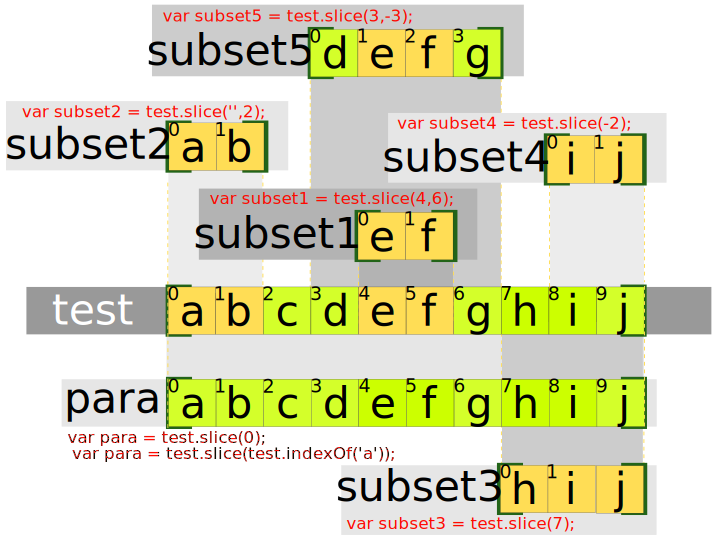

# Array.prototype.slice()

Această metodă nu afectează array-ul original. Slice în limba engleză se referă la *a tăia*, *a decupa*, *a extrage o bucată*. Pentru a înțelege `slice`, cel mai bine este să vă imaginați un croitor care măsoară stofa cu un centimetru, face semne pentru bucata pe care o dorește și apoi taie materialul.

Slice pentru array-uri este o metodă care returnează un nou array. Acesta este o copie a unei porțiuni delimitate prin argumentele pasate. Slice nu alterează array-ul original în niciun fel.

Ca parametri acceptă:

-   indexul de la care să pornească,
-   indexul la care să se oprească.

Dacă indexul de pornire este o valoare negativă, atunci se va porni de la finalul array-ului spre indexul 0. Dacă nu este menționat indexul (`undefined`), atunci `slice` pornește de la `0`. Dacă nu se menționează capătul, atunci va *tăia* până la capăt.

Atenție, `slice` se duce până la limita menționată, dar nu include și valoarea de la indexul menționat.

Menționarea unui index negativ indică limita către coada listei. De exemplu, un `slice(2, -1)`, va extrage începând cu al treilea element până la penultimul element.



## Transformarea obiectelor array-like în array-uri

### Exemplul lui `arguments` într-un array

Această metodă este folosită și pentru a converti obiecte care seamănă cu array-urile în `Array`-uri noi. Pur și simplu se face un binding al metodei la obiect. Cel mai folosit exemplu este cel al folosirii lui `slice()` pentru a transforma `arguments` într-un array:

```javascript
var converteste = function(){
  return Array.prototype.slice.call(arguments);
};
var unArrayNou = converteste(1, "ceva", 23); // Array [ 1, "ceva", 23 ]
```

Trebuie lămurit aici de ce putem folosi o astfel de invocare a lui `slice()`.

Ceea ce tocmai am făcut este un apel direct a metodei `slice` pusă la dispoziție de prototipul obiectul intern `Array` folosind notația cu punct. Această metodă este ca oricare metodă, o funcție. Ca orice funcție, aceasta poate fi aplicată folosind metoda `call()` pusă la dispoziție de obiectul `Function`. Deci, aplicăm metoda `slice()` folosind `call()` pe obiectul care seamănă a array numit standardizat `arguments`.

În loc de `Array.prototype.slice.call(arguments)` se poate folosi pur și simplu `[].slice.call(arguments)`.

```javascript
var converteste = function(){
  return [].slice.call(arguments);
};
var unArrayNou = converteste(1, "ceva", 23); // Array [ 1, "ceva", 23 ]
```

### Exemplul unei colecții DOM transformată în array

```javascript
var colectieDeP = document.body.getElementsByTagName('p');
var arrColectie = Array.prototype.slice.call(colectieDeP, 0); // acum un array!
arrColectie.forEach(function(element){
  console.log(element);
});
```

### `NodeList` într-un array

Este necesar pentru manipularea ușoară a elementelor din DOM.

```javascript
var listaDivuri = document.querySelectorAll('div'); // returnează NodeList
var arrayDivuri = Array.prototype.slice.call(listaDivuri); // convertește NodeList în Array
```

Se poate folosi operatorul spread.

```javascript
var listaDivuri = document.querySelectorAll('div'); // returnează NodeList
var arrayDivuri = [...listaDivuri]; // convertește NodeList în Array
```

Se mai poate face conversiune și folosind `Array.from()`.

```javascript
var listaDivuri = document.querySelectorAll('div'); // returnează NodeList
var arrayDivuri = Array.from(listaDivuri); // convertește NodeList în Array
```
