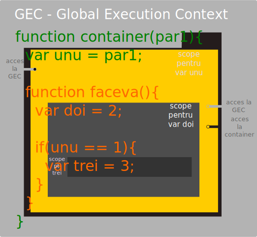

# Scope

Posibilă traducere în limba română: „perimetru” sau „arie de efect”.

Scope-ul nu se realizează la nivel de bloc în JavaScript pentru declarațiile `for`, `while`, `if` și `switch`.

```js
function faCeva (){
  if(!oVar){
    var oVar = 30;
  }
  console.log(oVar);
};
faCeva(); //-> 30
```

Este observabil faptul că variabila declarată în `if` este accesibilă în afara blocului if. Acest lucru se petrece datorită mecanismului de hoisting.

## Definiții
Este **locul** unde te uiți după lucruri.
Este **perimetrul** din cuprinsul codului în care au efect funcțiile și sunt disponibile variabilele.
Global scope este locul de unde pot fi accesate funcții și variabile în întreg codul.

Javascript generează un scope lexical, care se leagă fix de locul unde s-a făcut o declarație. Nu este unul dinamic.

## Un exemplu în cazul obiectelor

```js
function Obi(){
  var obi = new Object();
  obi.token = 100;
  obi.mesaj = function(){
    console.log('Esti un om de nota ' + this.token);
    console.log(this);
  };
  setInterval(obi.mesaj, 2000);
  return obi;
};
Obi();
// Object { token: 100, mesaj: Obi/obi.mesaj(), ceva: Obi/obi.ceva() }
// Esti un om de nota undefined
```

Atenție!
În cazul invocării lui setInterval `this` este setat la obiectul global, care este, de regulă, `window`. Acest lucru se întâmplă pentru că setInterval se execută într-un context diferit de cel în care este invocat. setInterval va căuta o funcție `obi.ceva` în obiectul `window`. Acest lucru se întâmplă pentru că setInterval schimbă contextul la global și astfel taie calea către funcția cu rol de metodă din obi. Bineînțeles, funcția care există în obi cu rol de metodă nu există în obiectul global. Pentru ca referința să se facă corect, `obi.mesaj` trebuie apelată ca metodă: `obi.ceva()`. Când setInterval va invoca `obi.ceva` ca funcție și nu ca metodă, nu va avea acces la `this`. Doar metodele au acces la `this`. În cazul de mai sus Obi() își va încheia execuția după returnarea obiectului.

```js
function Obi(){
  var obi = new Object();
  obi.token = 100;
  obi.mesaj = function(){
    console.log('Esti un om de nota ' + this.token);
    console.log(this);
  };
  setInterval(function(){obi.mesaj();}, 2000);
  return obi;
};
Obi();
// Object { token: 100, mesaj: Obi/obi.mesaj(), ceva: Obi/obi.ceva() }
// Esti un om de nota 100
// blocul se repetă
```

În acest al doilea caz, invocăm funcția cu rol de metodă dintr-un callback. Motivul pentru care se scope-ul este corect este pentru că funcția care invocă metoda trăiește în același scope cu obiectul pentru care invocă metoda. Funcția anonimă (callback-ul) oferă posibilitatea de a executa metoda și de a ne asigura că nu va executa ca funcție. Dacă s-ar invoca direct metoda `obi.mesaj()`, aceasta s-ar executa o singura dată la momentul execuției lui Obi() și apoi ar pierde scope-ul la a doua invocare în favoarea lui global. În acest caz Obi() va continua execuția pânî când setInterval va fi întrerupt.

## Mantre

- JavaScript are o fază de compilare.
- JavaScript are un **scope lexical** generat la faza de compilare. Acesta este de fapt, un set de reguli pentru a determina cum se face căutarea după un anume identificator.
- Declararea funcțiilor generează SCOPE-ul.
- Când funcțiile sunt executate SCOPE-ul folosit este cel de la MOMENTUL DEFINIRII (faza de compilare), nu cel de la momentul invocării (asta înseamnă LEXICAL SCOPE, de fapt).
- **Scope chain** este totalitatea obiectelor care definesc variabilele existente în scope pentru o secvență de cod. Când motorul are nevoie să găsească valoarea unei variabile, se uită la primul obiect din lanț. Operațiunea se mai numește „walking up the scope chain".
- Când este definită o funcție, aceasta stochează scope chain-ul care era în efect în acel moment.
- Obiectul creat de invocarea unei funcții este adăugat scope chain-ului existent.
  - Scope chain-ul astfel rezultat reprezintă scope chain-ul de la acel moment.
  - Obiectul rezultat de fapt are rolul de a face legăturile tuturor variabilelor funcției în scope chain.
- Când funcția returnează, obiectul care face binding-ul variabilelor este scos din **scope chain**.
- Dacă nu există funcții interne, nu mai există nicio legătură spre obiectul care face binding-ul variabilelor și se face GARBAGE COLLECTING.
- Când sunt definite funcții interne, acestea la rândul lor generează referințe în scope chain.
- **Dacă o funcție internă este returnată sau introdusă într-o variabilă**, atunci va exista o referință către aceasta și nu se va face garbage collecting (avem un closure).
- Scope chain-ul unui closure este unul viu; funcțiile interne nu fac copii private ale scope-ului și nici nu fac snapshoturi ale binding-urilor variabilelor.

## Variabilele din scope

Scope-ul unei variabile poate fi înțeles setul de linii de cod sursă pentru care este definit un identificator.
Variabilele locale sunt disponibile funcției în care au fost declarate și tuturor funcțiilor interne.
Variabilele locale sunt reatribuite cu valori de fiecare dată când o funcție este invocată.
Nu uita, parametrii unei funcții sunt la rândul lor variabile locale.

Declarațiile de variabile se află în scope de la momentul în care au fost declarate, până la închiderea blocului funcției în care au fost declarate indiferent de imbricarea altor blocuri `{}`.

Funcțiile care poartă nume se află în scope-ul întreg al funcției în care au fost declarate indiferent de adâncimea blocurilor imbricate.

## Alonjă

Necesar pentru înțelegerea clojure-urilor.

## Q\&A

**Întrebare**: Când se formează scope?
**Răspuns**: La faza de compilare.

Iată cum arată scope-ul ca reprezentare și ca arie în care are efect o variabilă sau o funcție.



## Aprofundare prin efect
- ### [Clojures](clojures/clojures.md "Subiectul clojures")
  - #### [Clojures in loop](clojures/clojures.md "Caz explicat de clojures")
